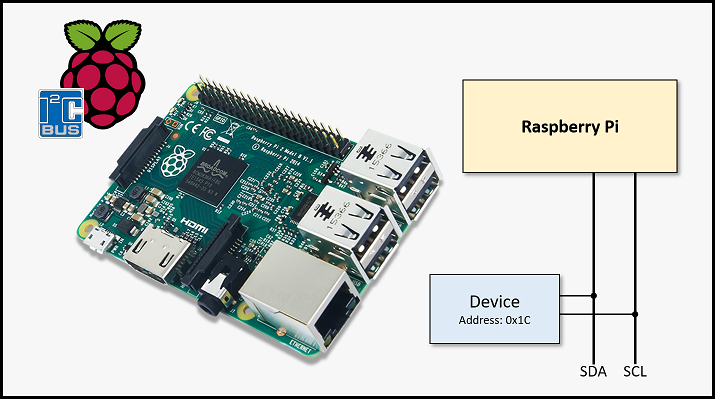
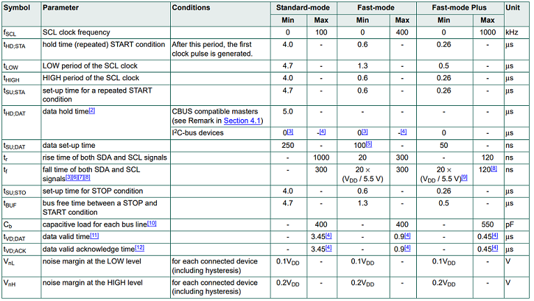
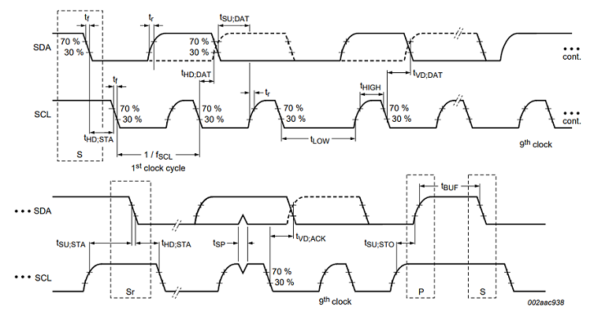
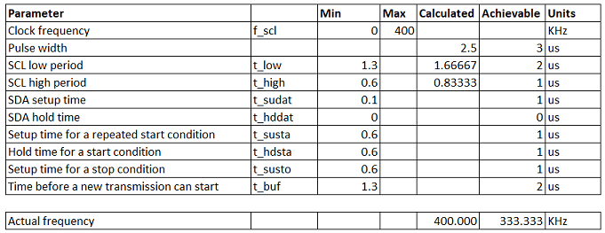
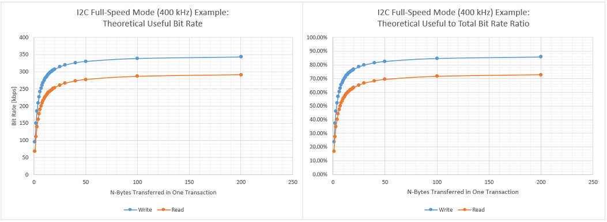

# Inter-Integrated Circuit (I2C) Library for the Raspberry Pi

pi_i2c.c provides a comprehensive I2C library for the Raspberry Pi. Unlike the Pi's built-in I2C controller, any number of GPIOs can be defined as the SCL and SDA line thus allowing flexible configuration and additional I2C busses to be defined. Additional features of this library include multi-byte read & write functions, scan function, clock stretching support, error handling, and useful statistics.

This library requires the following dependencies (projects also authored by me):
* [pi_lw_gpio.c](https://github.com/besp9510/pi_lw_gpio)
    * "Lightweight GPIO Interface Library for the Raspberry Pi"
* [pi_microsleep_hard.c](https://github.com/besp9510/pi_microsleep_hard)
    * "Hard Microsleep Library Via System Timer for the Raspberry Pi"

They are not required to compile pi_i2c.c into a shared library but are required to be linked when building your project.



pi_i2c.c is provided three ways for flexibility:
1. C source and header files that can be compiled along with your program
2. C shared library
3. Python package
    * Interface with pi_i2c.c using Python 3!

A test script is included in this repository to checkout the library working on your Pi. You can also checkout this [LIS3MDL example](https://github.com/besp9510/pi_lis3mdl_example) I wrote to test out the library on a specific device.

## Getting Started

These instructions will get you a copy of the project up and running on your local machine for development and testing purposes.

### Installing

#### Obtain the Project

First, clone this repository.

```
$ git clone https://github.com/besp9510/pi_i2c.git
```

Alternatively, download the repository from Git.

#### Configure

Once obtaining a copy on your local machine, navigate to the top directory and run the configure script to generate a Makefile.

```
$ ./configure
```

By default, files will be installed under `/usr/local/`. Note that passing the option ``--help`` will display available configuration options such as installation directory prefix and debug symbols.

#### Make

Compile pi_i2c.c into a shared library.

```
$ make
```

Then install files to the installation directory. You must run the following either as root or with root privileges.

```
$ sudo make install
```

To use pi_i2c.c in your project, simply include the header file `pi_i2c.h` and link to the shared library `-lpii2c`, `-lpilwgpio`, & `-lpimicrosleephard`. 

**If using the Pi's default SDA & SCL pins (BCM pin 2 & 3), ensure that Raspian I2C interface is disabled via rasp-config or otherwise risk unpredictable behavior!**

#### Uninstall

At anytime, to uninstall pi_i2c.c, use the same Makefile used for compiling or a Makefile generated using the configuration script with the same options as root or with root privileges.

```
$ sudo make uninstall
```

## Running the Test

test_pi_i2c.c is a test script to check and see the I2C library working on your Pi with some I2C device. The outline of the test is:
1. Defining I2C address and registers to test with
2. Setting up pi_i2c()
3. Writing and reading 1 and multiple bytes one-shot and iteratively
4. Bit rate read and write tests
5. Testing get config and statistics functions

Prior to running the test, make sure to update the I2C address and registers for your specific device.

``` c
// Ensure that Raspian I2C interface is disabled via rasp-config otherwise
// risk unpredictable behavior!
int sda_pin = 2; // UPDATE
int scl_pin = 3; // UPDATE

int speed_grade = I2C_FULL_SPEED;

// Addresses & data to use when testing write:
int write_slave_address = 0x1C;     // UPDATE
int write_register_address = 0x21;  // UPDATE
int write_data[1] = {0x00};         // UPDATE
int write_bytes = 1;                // UPDATE
int write_iterations = 10;

int write_slave_address_multiple = 0x1C;    // UPDATE
int write_register_address_multiple = 0x23; // UPDATE
int write_data_multiple[2] = {0x0, 0x0};    // UPDATE
int write_bytes_multiple = 2;

int read_slave_address = 0x1C;    // UPDATE
int read_register_address = 0x0F; // UPDATE
int read_bytes = 1;               // UPDATE
int read_iterations = 10;
int read_data[1];                 // UPDATE

int read_slave_address_multiple = 0x1C;      // UPDATE
int read_register_address_multiple = 0x28;   // UPDATE
int read_bytes_multiple = 2;                 // UPDATE
int read_data_multiple[read_bytes_multiple]; // UPDATE
```

### Prerequisites

This test requires the following dependencies (projects also authored by me):
* [pi_lw_gpio.c](https://github.com/besp9510/pi_lw_gpio)
    * "Lightweight GPIO Interface Library for the Raspberry Pi"
* [pi_microsleep_hard.c](https://github.com/besp9510/pi_microsleep_hard)
    * "Hard Microsleep Library Via System Timer for the Raspberry Pi"

### Installing

To compile the test script, first navigate to the test directory `test/`. Next, run the configure script to generate the Makefile:

```
$ ./configure
```

By default, the pi_i2c.c shared library will be looked for under the standard directories (e.g. `/usr/local/`). If this is not the case, pass the option `--help` to learn how to specify a directory to be searched. Additionally, `--help` will also display available configuration options such as debug symbols and debug logs.

Next, compile the test script:

```
$ make
```

This will create an executable called `test_pi_i2c` under `bin/`.

## Documentation
pi_i2c.c implements I2C according to the [UM10204 I2C-bus specification and user manual](https://www.nxp.com/docs/en/user-guide/UM10204.pdf). Specifically, the following I2C bus protocol features are supported for **single master configuration only**:
* START condition
* STOP condition
* Acknowledge
* Clock Stretching
* 7-bit slave address
* Software reset
    * *See error handling for more details*
* Standard-mode and full-speed mode
* Single and multiple byte read and write functionality

Additionally, timing minimums are respected according to this table and diagram:





### Bus Error Handling

pi_i2c.c performs bus error detection and bus recovery (if able) to safe guard against hardware damage. This is done at every step of a message transaction:
1. Transition from IDLE to BUSY bus
2. Start, middle, and end of write or read message transaction
3. Transition from BUSY to IDLE bus

If an error is detected at any of these steps and cannot be resolved, no further action is taken by pi_i2c. An error code is reported and it is then responsibility of the caller to recover the bus (power cycle of the offending component is typical).

The following table summarizes the types of bus errors detected, actions taken by pi_i2c.c, the error number returned to the caller, and suggested recovery actions. Suggested recovery actions are to be performed by the caller. 

| Bus Error | Action Taken | Error Number | Further Recovery Actions|
|-|-|-|-|
| Slave did not acknowledge slave address | Halt transaction and return error number | `ENACK` | Check if slave is responsive; otherwise power cycle slave |
| Slave did not acknowledge register address | Halt transaction and return error number | `EBADREGADDR` | Check if slave is responsive; otherwise power cycle slave |
| Slave did not acknowledge during byte transfer | Halt transaction and return error number | `EBADXFR` | Check if slave is responsive; otherwise power cycle slave |
| Slave not responsive after clock stretch timeout (slave forcing SCL line held low) | Halt transaction and return error number | `ECLKTIMEOUT` | Check if slave is responsive; otherwise power cycle slave |
| Slave did not respond after repeated start | Halt transaction and return error number | `ENACKRST` | Check if slave is responsive; otherwise power cycle slave |
| Slave is forcing SDA line low (slave hung) | Reset bus to recover; if still hung, halt transaction and return error number | `ESLAVEHUNG` | Power cycle slave |
| Slave is holding SDA and SCL lines low causing bus to be locked | Halt transaction and return error number | `EBUSLOCKUP` | Power cycle slave |
| Slave is forcing SDA and/or SCL line low causing START condition writes to fail | Halt transaction and return error number | `EFAILSTCOND` | Power cycle slave |
| Bus is an unexpected state following an unknown error | Halt transaction and return error number | `EBUSUNKERR` | Power cycle slave |

Bottom line: if pi_i2c.c sees the bus in an expected state at any time then the transaction will be cancelled. This is to prevent any accidental and undefined data transfers to take place which may cause hardware damage (ask me about my broken IMU if would like to know more about this).

### Notes on Bit Rate
Bit rate achievable by pi_i2c.c is primarily a function of the clock accuracy, minimum I2C timings, and I2C protocol messaging overhead:
* [pi_microsleep_hard.c](https://github.com/besp9510/pi_microsleep_hard) provides a hard microsleep function with a resolution of 1 us
* Minimum I2C timings (found in the above table) rounded up to the nearest 1 us (per pi_microsleep_hard.c)
* Messaging overhead: STOP, START, Repeated START conditions, ACKS, and slave & register addresses

Using these constraints, pi_i2c.c achieves a total and useful bit rate that will be lower than ideal. I2C full-speed mode (400 kHz), for example, would have the following timings:



Actual frequency is less than the desired 400 kHz due to the 1 us rounding on T_Low & T_High required by the hard microsleep function. Additionally, consider the minimum I2C timings have also been rounded resulting is longer wait times. End result is smaller bit rate at the trade of flexibility and overall features pi_i2c.c provides.

The theoretical useful bit rate can be then calculated for a n-byte read and write transaction using these achievable timings. Useful bit rate is defined as how much "useful" data is being transferred in a given read or write transaction. Not all data in an I2C message is useful in the sense that some of it is overhead and not the data we are actually trying to transfer between the master and slave device. Theoretical useful bit rates are calculated and plotted for the I2C full-speed mode (400 kHz) example discussed above:



*Note that these are theoretical useful bit rates. In practice, pi_i2c.c will provide lower rates than these theoretical values because of the operating system's overhead and scheduler.*

The asymptotic trend lines of write and read is the result of transferring more data in one transaction while messaging overhead remains constant (number of STARTs, STOPs, ACKs, and register addresses do not change). As the number of bytes read/written increases, the smaller penalty the messaging overhead imposes resulting in a useful bit rate that asymptotically approaches ~348 kbps for write and ~297 kbps for read. I2C transactions that transfer only a couple of bytes at a time are much more inefficient than ones that transfer 10s of bytes.

### Functions

#### Configure I2C Library
Setup the library prior to using pi_i2c.c. Define which GPIO pins will be used for the SDA & SCL lines and what the speed grade (bit rate) is. This function must be called prior to using any other functions or otherwise they will return the `EI2CNOTCFG` error number. Any GPIO pins can be used but if you select the Pi's default SDA & SCL pins (BCM pin 2 & 3), ensure that Raspian I2C interface is disabled via rasp-config or otherwise risk unpredictable behavior. Available speed grades to choose from are:
* `I2C_STANDARD_MODE` (100 kHz)
* `I2C_FULL_SPEED` (400 kHz)

```c
int config_i2c(unsigned int sda, unsigned int scl, unsigned int speed_grade);
```

`unsigned int sda` is the GPIO pin to use for the SDA line (BCM numbering).

`unsigned int scl` is the GPIO pin to use for the SCL line (BCM numbering).

`unsigned int speed_grade` is the speed grade (bit rate) to use for the I2C bus according to standard I2C definition.

##### Return Value
`config_i2c()` returns 0 upon success. On error, an error number is returned.

Error numbers:
* `ENOPIVER` : Could not get Pi board revision.
* `MAP_FAILED` : Memory map failed (most likely due to permissions)
* `EINVAL` : Invalid argument (e.g. sda, scl, or speed grade out of range)

#### Scan I2C Bus
Scan the bus for any I2C slaves. Note that only 7-bit addresses are supported. The function requires a pointer to an address book (a 127-element integer array) to be passed as an argument. The indices of this address book correspond directly to an I2C address; for example, index 0x1 of the array corresponds to an I2C device at an address of 0x1.

```c
address_book[127] = {
    [Index/Address] = 0 (Not present) / 1 (Detected)
}
```

The results of the bus scan will be stored back into this address book. If the value of an element at index *i* equals 1 then a I2C device at an address equaling index *i* is present.

```c
int scan_bus_i2c(int *address_book);
```

The address book `int *address_book` argument is a pointer to a 127-element integer array where the results of the bus scan are stored back into.

##### Return Value
`scan_bus_i2c()` returns 0 upon success. On error, an error number is returned.

Error numbers:
* `EI2CNOTCFG` : pi_i2c has not yet been configured
* `ESLAVEHUNG` : Slave forcing SDA line low
* `ECLKTIMEOUT` : Slave not responsive after clock stretch timeout
* `EBUSLOCKUP` : Bus is locked: SDA and SCL lines are being held low by slave
* `EBUSUNKERR` : Bus is in an unexpected state following an unknown error
* `ECLKTIMEOUT` : Slave not responsive after clock stretch timeout
* `EFAILSTCOND` : Failed to write a START condition to the bus. Most likely, error occurred during a previous STOP condition.

#### Write

Write n-bytes to a device's register address. Data to write to the device's register address is passed into the function as a pointer to an n-byte integer data array.

```c
int write_i2c(unsigned int slave_address, unsigned int register_address, int *data, unsigned int n_bytes);
```

The `unsigned int slave_address` argument is the slave's I2C address.

The `unsigned int register_address` argument is the specific register data will be written to.

Data to write to the slave's register address is stored in the `int *data` argument: a `n_bytes` integer array that is passed into the function as a pointer.

Number of bytes `unsigned int n_bytes` argument is the number of bytes to write to the slave's register address. `int *data` must be at least `n_bytes` large.

##### Return Value
`write_i2c()` returns 0 upon success. On error, an error number is returned.

Error numbers:
* `EI2CNOTCFG` : pi_i2c has not yet been configured
* `ESLAVEHUNG` : Slave forcing SDA line low
* `ECLKTIMEOUT` : Slave not responsive after clock stretch timeout
* `EBUSLOCKUP` : Bus is locked: SDA and SCL lines are being held low by slave
* `EBUSUNKERR` : Bus is in an unexpected state following an unknown error
* `ECLKTIMEOUT` : Slave not responsive after clock stretch timeout
* `EFAILSTCOND` : Failed to write a START condition to the bus. Most likely, error occurred during a previous STOP condition.
* `ENACK` : Slave did not acknowledge slave address
* `EBADXFR` : Slave did not acknowledge during byte transfer (read or write)
* `EBADREGADDR` : Slave did not acknowledge register address
* `EINVAL` : Invalid argument (e.g. slave_address or register address out of range; negative n_bytes)

#### Read

Read n-bytes from a device's register address. Data read from the device will be stored back into the n-byte integer data array passed into the function by pointer.

```c
int read_i2c(unsigned int slave_address, unsigned int register_address, int *data, unsigned int n_bytes);
```

The `unsigned int slave_address` argument is the slave's I2C address.

The `unsigned int register_address` argument is the specific register data will be read from. Note, when more than 1 byte is read from A register, the register address will automatically increase by 1 each time a byte is read. This results in the n-byte of data being read from `int register_address` + n (indexed from 0).

Data read from slave's register address is stored back in the `int *data` argument: a `n_bytes` integer array that is passed into the function as a pointer. 

Number of bytes `unsigned int n_bytes` argument is the number of bytes to read to the slave's register address. `int *data` must be at least `n_bytes` large.

##### Return Value
`read_i2c()` returns 0 upon success. On error, an error number is returned.

Error numbers:
* `EI2CNOTCFG` : Pi I2C has not yet been configured
* `ESLAVEHUNG` : Slave forcing SDA line low
* `ECLKTIMEOUT` : Slave not responsive after clock stretch timeout
* `EBUSLOCKUP` : Bus is locked: SDA and SCL lines are being held low by slave
* `EBUSUNKERR` : Bus is in an unexpected state following an unknown error
* `ECLKTIMEOUT` : Slave not responsive after clock stretch timeout
* `EFAILSTCOND` : Failed to write a START condition to the bus. Most likely, error occurred during a previous STOP condition.
* `ENACK` : Slave did not acknowledge slave address
* `EBADXFR` : Slave did not acknowledge during byte transfer (read or write)
* `EBADREGADDR` : Slave did not acknowledge register address
* `ENACKRST` : Slave did not respond after repeated start slave address
* `EINVAL` : Invalid argument (e.g. slave_address or register address out of range; negative n_bytes)

#### Reset Bus

Reset I2C bus by issuing 9 clock pulses. Typically used to un-stuck the SDA line after a slave is forcing it low. This function is automatically called in the case of error handling but is available to used at any time.

```c
int reset_i2c(void);
```

##### Return Value
`reset_i2c()` returns 0 upon success. On error, an error number is returned.

Error numbers:
* `EI2CNOTCFG` : Pi I2C has not yet been configured
* `ECLKTIMEOUT` : Slave not responsive after clock stretch timeout

#### Get Statistics

Return a structure of statistics recorded by Pi I2C.

```c
struct pi_i2c_statistics get_statistics_i2c(void);
```

##### Return Value
`get_statistics_i2c()` always returns 0 upon success.

#### Get Configs

Return a structure of internal configurations of Pi I2C.

```c
struct pi_i2c_configs get_configs_i2c(void);
```

##### Return Value
`get_configs_i2c()` always returns 0 upon success.

## Contributing
Follow the "fork-and-pull" Git workflow.
1. Fork the repo on GitHub
2. Clone the project to your own machine
3. Commit changes to your own branch
4. Push your work back up to your fork
5. Submit a Pull request so that your changes can be reviewed

Be sure to merge the latest from "upstream" before making a pull request!

Feel free to email at the email address under my account name if you have any questions.
## Authors

Benjamin Spencer

## License

This project is licensed under the MIT License - see the [LICENSE.md](LICENSE.md) file for details